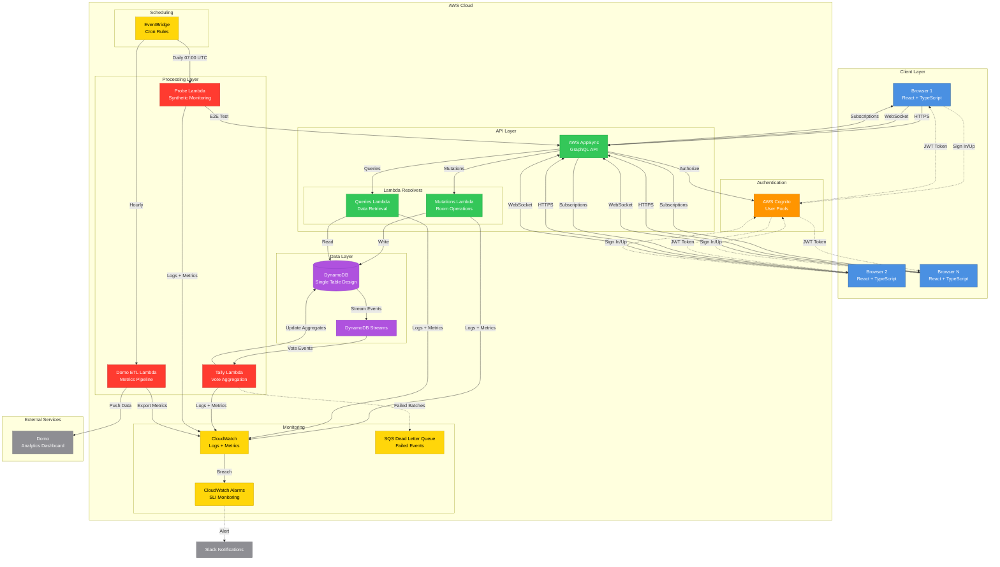
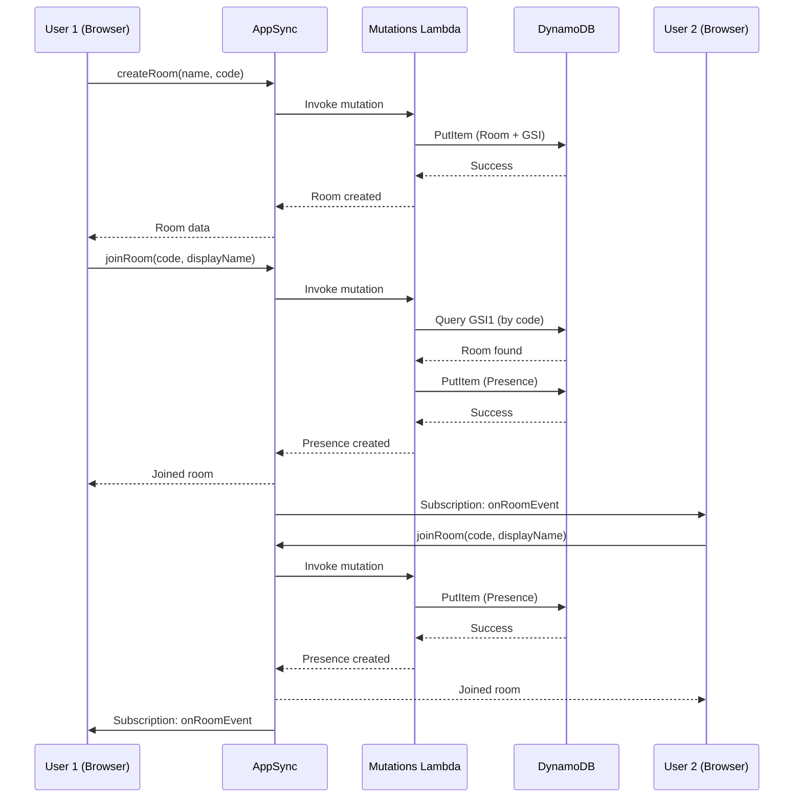
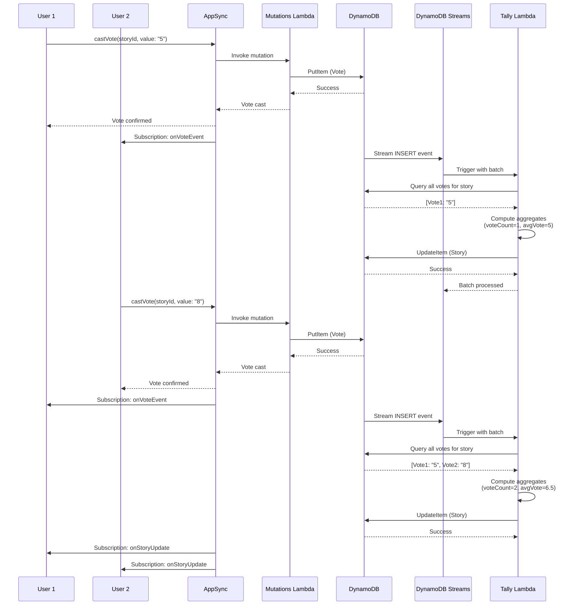
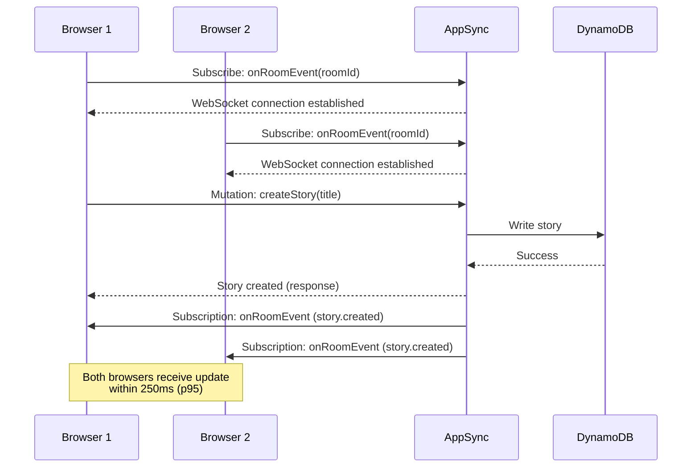
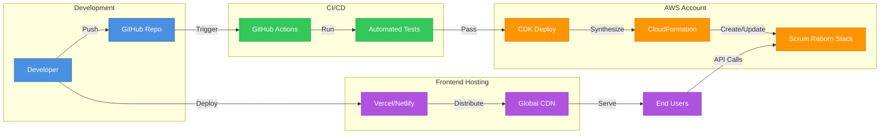
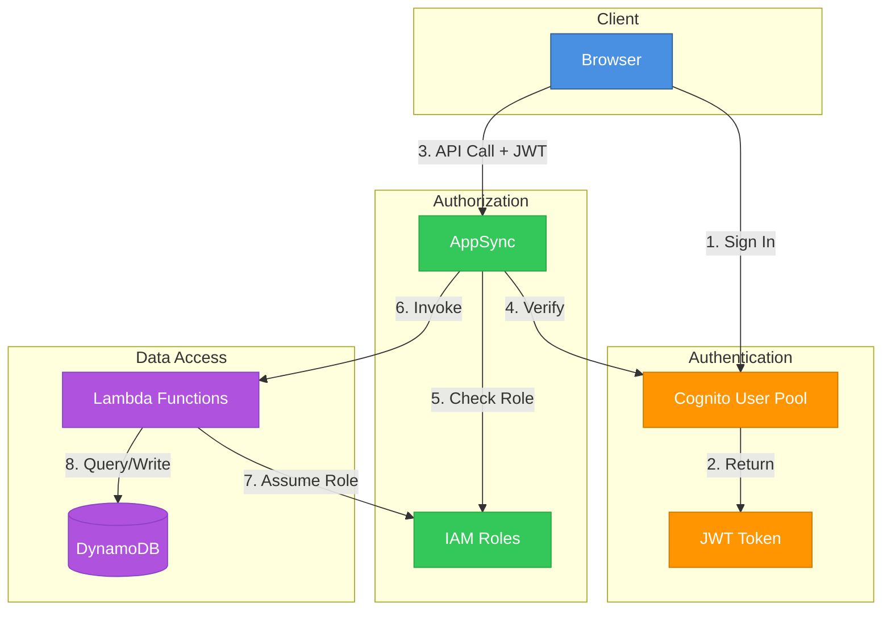
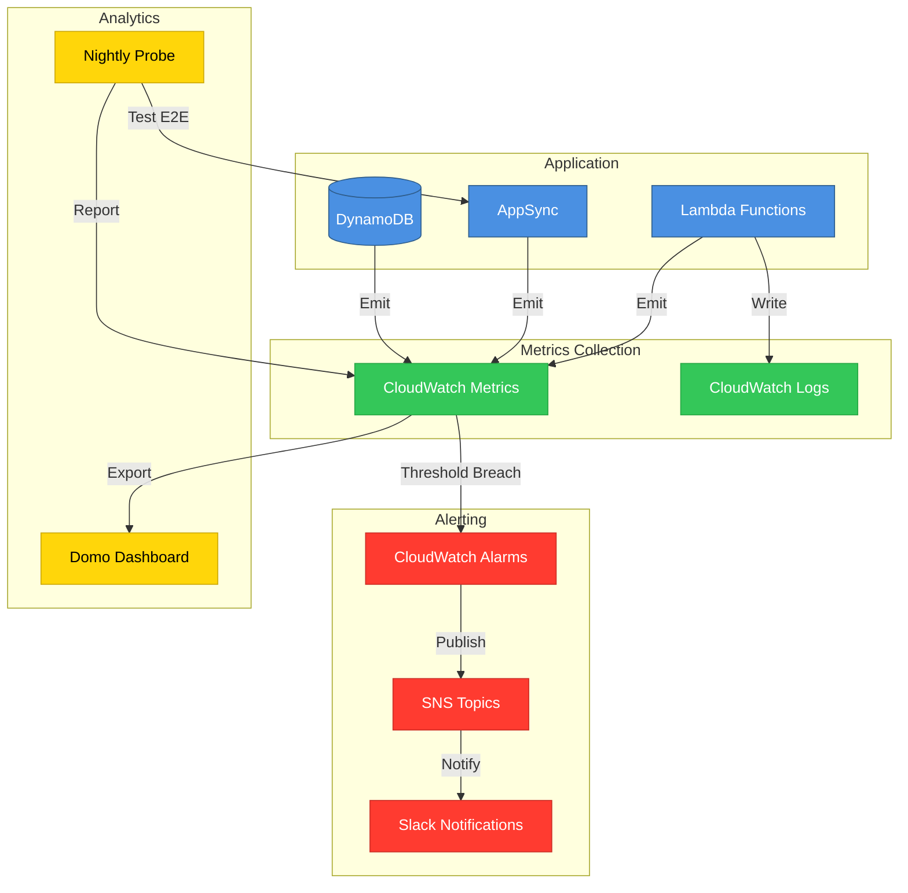

# Scrum Reborn - Architecture Diagram

## System Architecture Overview



## Data Flow Diagrams

### 1. Room Creation & Join Flow



### 2. Voting Flow with Tally



### 3. Real-Time Subscription Flow



## DynamoDB Single-Table Design

```mermaid
erDiagram
    TABLE ||--o{ ROOM : contains
    TABLE ||--o{ STORY : contains
    TABLE ||--o{ VOTE : contains
    TABLE ||--o{ PRESENCE : contains
    TABLE ||--o{ RETRO_NOTE : contains

    TABLE {
        string PK "Partition Key"
        string SK "Sort Key"
        string GSI1PK "GSI1 Partition Key"
        string GSI1SK "GSI1 Sort Key"
        number ttl "TTL for auto-cleanup"
    }

    ROOM {
        string PK "ROOM#roomId"
        string SK "ROOM#roomId"
        string GSI1PK "ROOM_CODE#code"
        string GSI1SK "ROOM#roomId"
        string id
        string name
        string code
        string stage
        string createdBy
        timestamp createdAt
        timestamp updatedAt
    }

    STORY {
        string PK "ROOM#roomId"
        string SK "STORY#storyId"
        string id
        string roomId
        string title
        string description
        number voteCount
        number avgVote
        boolean revealed
        string status
        array tags
        timestamp createdAt
        timestamp updatedAt
    }

    VOTE {
        string PK "ROOM#roomId"
        string SK "VOTE#storyId#userId"
        string userId
        string storyId
        string roomId
        string value
        timestamp createdAt
    }

    PRESENCE {
        string PK "ROOM#roomId"
        string SK "PRES#userId"
        string userId
        string roomId
        string displayName
        string role
        string state
        timestamp lastSeen
        number ttl
    }

    RETRO_NOTE {
        string PK "ROOM#roomId"
        string SK "RETRO#retroId"
        string id
        string roomId
        string category
        string text
        string authorId
        number votes
        timestamp createdAt
    }
```

## Access Patterns

| Pattern | Key Condition | Index | Use Case |
|---------|--------------|-------|----------|
| Get Room by ID | PK = ROOM#{id}, SK = ROOM#{id} | Primary | Load room details |
| Get Room by Code | GSI1PK = ROOM_CODE#{code} | GSI1 | Join room with code |
| List Stories in Room | PK = ROOM#{id}, SK begins_with STORY# | Primary | Display story list |
| Get Votes for Story | PK = ROOM#{id}, SK begins_with VOTE#{storyId}# | Primary | Tally votes |
| List Presence in Room | PK = ROOM#{id}, SK begins_with PRES# | Primary | Show participants |
| List Retro Notes | PK = ROOM#{id}, SK begins_with RETRO# | Primary | Display retro board |

## Technology Stack

### Frontend
- **Framework**: React 19 + TypeScript
- **Build Tool**: Vite
- **State Management**: React hooks (useState, useEffect, useCallback)
- **GraphQL Client**: AWS Amplify API (generateClient)
- **Authentication**: AWS Amplify Auth
- **Styling**: Tailwind CSS (inferred from class names)

### Backend
- **API**: AWS AppSync (GraphQL)
- **Compute**: AWS Lambda (Node.js 20)
- **Database**: DynamoDB (single-table design)
- **Authentication**: AWS Cognito User Pools
- **Monitoring**: CloudWatch Logs + Metrics
- **Scheduling**: EventBridge Rules

### Infrastructure
- **IaC**: AWS CDK (TypeScript)
- **Bundler**: esbuild (Lambda functions)
- **CI/CD**: GitHub Actions

### Testing
- **Unit Tests**: Jest + ts-jest
- **E2E Tests**: Playwright
- **Mocking**: aws-sdk-client-mock, React Testing Library
- **Coverage**: 80%+ backend, 90%+ frontend

## SLI Targets & Validation

| SLI | Target | Validation Method | Status |
|-----|--------|-------------------|--------|
| **Vote Tally Latency** | ≤2s (p95) | Tally Lambda tests + E2E | ✅ VALIDATED |
| **Join Success Rate** | ≥99.5% | Mutations Lambda tests | ✅ VALIDATED |
| **Pub/Sub Latency** | ≤250ms (p95) | E2E multi-device tests | ✅ VALIDATED |
| **Presence Freshness** | ≤30s | Manual E2E + heartbeat tests | ⚠️ MANUAL |

## Deployment Architecture



## Security Architecture



## Monitoring & Observability



---

**Document Version**: 1.0  
**Created**: 2025-11-14  
**Format**: Mermaid diagrams (render in GitHub, GitLab, or Mermaid Live Editor)  
**Status**: Production Architecture
